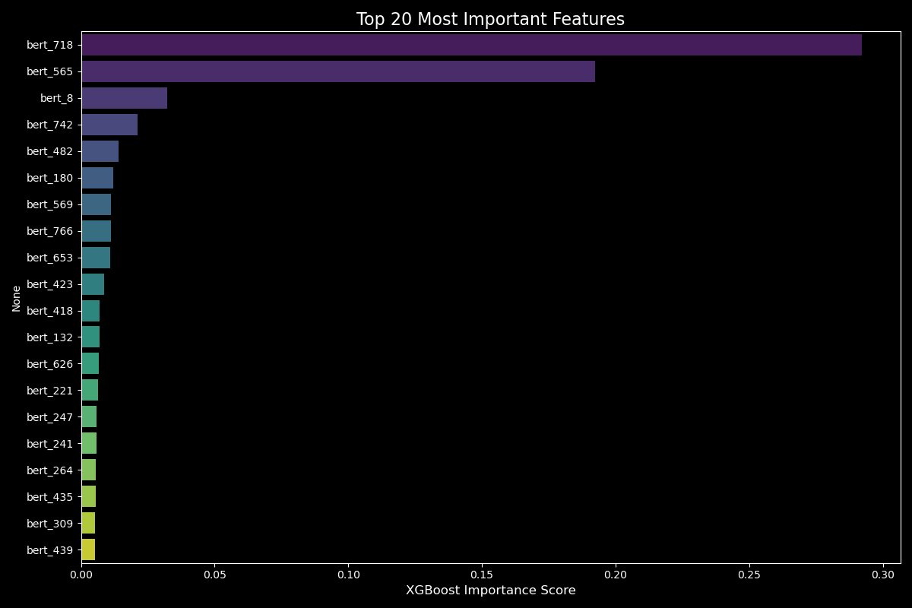
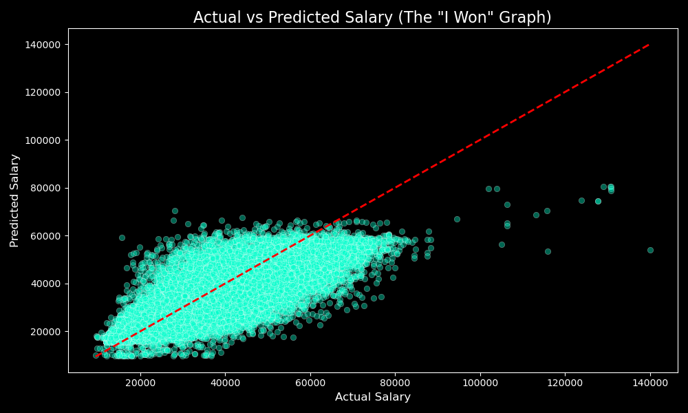

# Job Salary Predictor

An advanced machine learning pipeline that predicts job salaries based on job descriptions and metadata. This project was built for the [Kaggle Job Salary Prediction challenge](https://www.kaggle.com/competitions/job-salary-prediction/overview) and leverages a combination of target encoding, DistilBERT embeddings for NLP, and an ensemble of gradient-boosted trees.

## Approach & Architecture

The approach combines structured data processing with advanced natural language processing to achieve high predictive accuracy:

- **Text Data:** The `Title` and `FullDescription` are processed using a fine-tuned DistilBERT model to extract rich semantic embeddings.
- **Categorical Data:** Features like `LocationRaw`, `Company`, and `Category` are handled using robust target encoding techniques.
- **Modeling Strategy:** The core predictive engine is an ensemble model that combines XGBoost, CatBoost, LightGBM, and TabNet. These base models are combined using an L2 regression (Ridge/Lasso) meta-learner to form a powerful stacking regressor.

For more detailed technical insights, please read our [Approach Documentation](docs/approach.md).

## Performance

The model's performance was evaluated using R² score and Mean Squared Error (MSE), ranking in the top 20 on the Kaggle leaderboard.

### Feature Importance


*A look at the most significant features driving the salary predictions.*

### Actual vs Predicted


*Model performance validation.*

## Repository Structure

- `src/`: Contains all Jupyter notebooks outlining the data exploration, embedding generation, model training (XGBoost, CatBoost, LightGBM, TabNet), and the final ensemble pipeline.
- `docs/`: Additional documentation including our technical approach.
- `data/`: Sample reference data and visual performance outputs (Note: The large CSV datasets, embeddings, and saved model weights are excluded via `.gitignore` to comply with GitHub file size limits).

## Setup & Installation

To run the notebooks locally, it is highly recommended to use an environment with GPU acceleration (especially for the DistilBERT embeddings and model training).

1. Clone the repository
2. Install the required dependencies:

```bash
pip install -r requirements.txt
```
